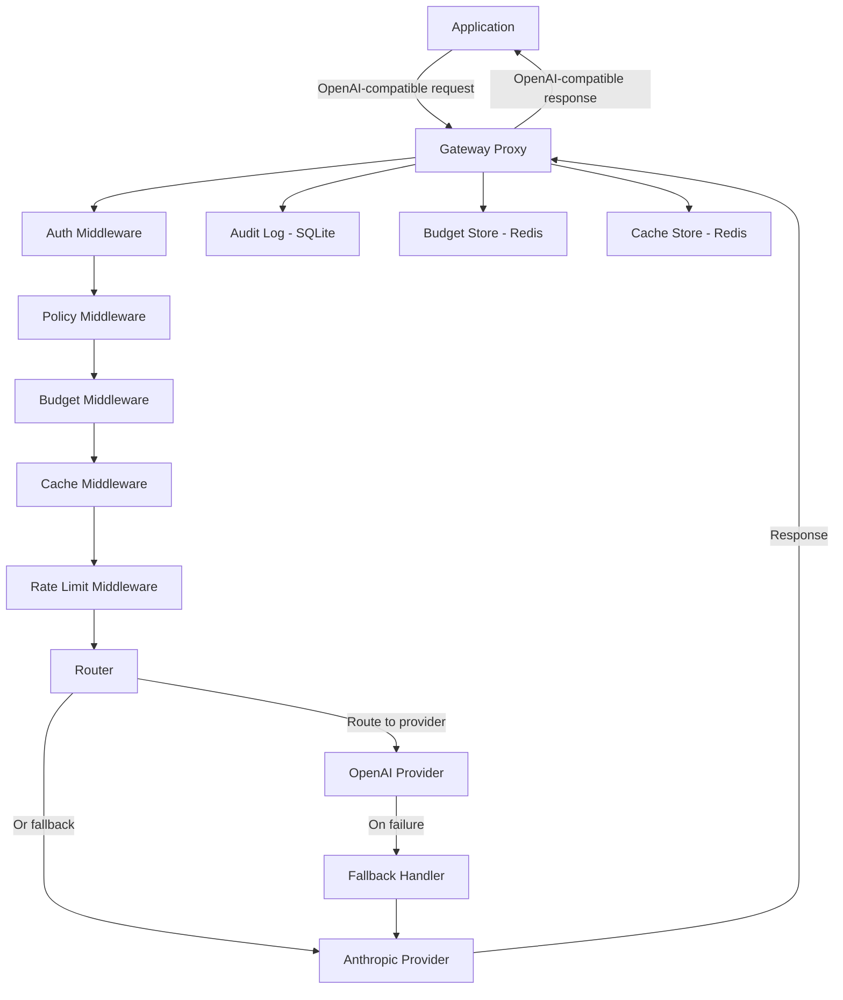

# LLM Gateway

[]() []() []() []() []()

**Enterprise LLM proxy with fallback, caching, rate limiting, and budget enforcement.**

Route requests across multiple providers (OpenAI, Anthropic) with automatic failover, response caching, and per-API-key cost control.

[Quick Demo](#quick-demo) • [Architecture](#architecture) • [Configuration](#local-quickstart)

---

## Quick Demo

```bash
make demo
```

Starts Redis, the gateway, and provides a sample curl command to test the proxy at http://localhost:3000

---

## 1. What This Is

A lightweight LLM operations gateway for routing, cost control, fallback, and auditability. It sits between your applications and LLM providers (OpenAI, Anthropic, etc.), acting as an intelligent proxy that enforces policies, manages costs, and ensures reliability.

## 2. What Problem It Solves

LLM calls in production are **unmanaged costs** — no fallback when providers fail, no audit trail for compliance, no policy enforcement for safety, no cost visibility until the bill arrives. This gateway brings operational control to every LLM interaction:

- **Cost control**: Per-user budgets, rate limits, cost-optimized routing
- **Reliability**: Automatic fallback chains, circuit breakers, retry logic
- **Auditability**: Full request/response logging, usage analytics
- **Policy enforcement**: Content filtering, model restrictions, PII detection

## 3. Why Naive AI Systems Fail Here

Direct API calls from applications create several systemic problems:

- **Vendor lock-in**: Switching providers means rewriting integration code everywhere
- **No cost control**: A single runaway agent can rack up thousands in API costs
- **No resilience**: Provider outages take down your entire AI pipeline
- **No visibility**: You can't answer "how much did feature X cost last month?"
- **No governance**: No way to enforce which models can be used for what purpose

The gateway pattern solves all of these by centralizing LLM operations behind an OpenAI-compatible API.

## 4. Architecture



## 5. Local Quickstart

```bash
# Clone and install
git clone <repo-url> && cd llm-gateway
npm install

# Configure providers
cp .env.example .env
# Edit .env with your API keys

# Configure routing and policies
cp config/routing.example.yaml config/routing.yaml
cp config/policy.example.yaml config/policy.yaml
cp config/budgets.example.yaml config/budgets.yaml

# Start Redis (required for caching and rate limiting)
docker compose up redis -d

# Start the gateway
npm run dev
```

Send a request:

```bash
curl -X POST http://localhost:3000/v1/chat/completions \
  -H "Authorization: Bearer your-gateway-key" \
  -H "Content-Type: application/json" \
  -d '{
    "model": "gpt-4o-mini",
    "messages": [{"role": "user", "content": "Hello!"}]
  }'
```

## 6. Example Workflow

1. Application sends an OpenAI-compatible request to the gateway
2. **Auth** middleware validates the API key and resolves permissions
3. **Policy** middleware checks content against filtering rules and model restrictions
4. **Budget** middleware verifies the API key has remaining budget
5. **Cache** middleware checks if an identical request was recently answered
6. **Rate limit** middleware ensures the key hasn't exceeded request thresholds
7. **Router** evaluates routing rules to select the best provider and model
8. The chosen **provider adapter** translates and forwards the request
9. If the provider fails, the **fallback handler** tries the next provider in the chain
10. **Logging** middleware records the full request/response to the audit log
11. The response is returned to the application in OpenAI-compatible format

## 7. Key Design Decisions

| Decision | Rationale |
|----------|-----------|
| **Proxy pattern** | Applications only need one endpoint; switching providers is a config change |
| **Middleware chain** | Each concern (auth, caching, budget) is isolated, testable, and composable |
| **Redis for hot data** | Caching and rate limiting need sub-millisecond latency; Redis delivers |
| **SQLite for audit logs** | Append-heavy, query-light workload; SQLite avoids operational overhead |
| **OpenAI-compatible API** | Zero migration cost — existing OpenAI SDKs work by changing the base URL |
| **YAML configuration** | Routing rules and policies should be version-controlled alongside application code |

## 8. Failure Handling

- **Provider fallback**: If the primary provider returns an error, the fallback chain tries the next provider automatically
- **Circuit breaker**: After repeated failures, a provider is temporarily removed from rotation
- **Timeout handling**: Configurable per-request timeouts prevent hanging connections
- **Retry logic**: Transient errors (rate limits, 5xx) are retried with exponential backoff
- **Graceful degradation**: If Redis is unavailable, the gateway continues without caching

## 9. Testing Strategy

```
tests/
├── routing.test.ts      # Rule evaluation, priority sorting, default fallback
├── fallback.test.ts     # Provider fallback chains, circuit breaker, retry limits
├── cache.test.ts        # Cache hits, misses, TTL expiry, key generation
├── budget.test.ts       # Budget tracking, limit enforcement, alerting
└── proxy.test.ts        # Full request pipeline, error handling, streaming
```

- **Unit tests**: Each middleware and service tested in isolation with mocks
- **Integration tests**: Full pipeline with mock provider (no real API calls)
- **Error path tests**: Provider failures, budget exceeded, policy denied

## 10. Deployment Notes

```bash
# Build and run with Docker
docker compose up -d

# Scale horizontally behind a load balancer
# Redis shared state allows multiple gateway instances

# Environment-specific config
# - Use .env for local development
# - Use environment variables in production
# - Mount config/ volume for routing and policy YAML
```

## 11. Roadmap

- [ ] Streaming support with SSE forwarding
- [ ] Admin dashboard with usage visualization
- [ ] Prometheus metrics endpoint (`/metrics`)
- [ ] Multi-region deployment support
- [ ] Webhook notifications for budget alerts
- [ ] Request/replay debugging tool
- [ ] Token counting and cost estimation before forwarding

## 12. What This Project Demonstrates

Middleware design, provider abstraction, cost management, reliability engineering, and API gateway patterns — the infrastructure layer that separates toy AI demos from production AI systems.
