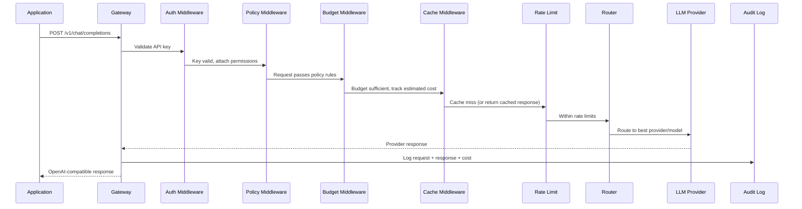
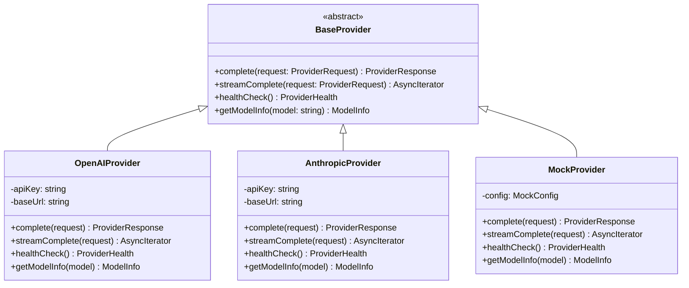
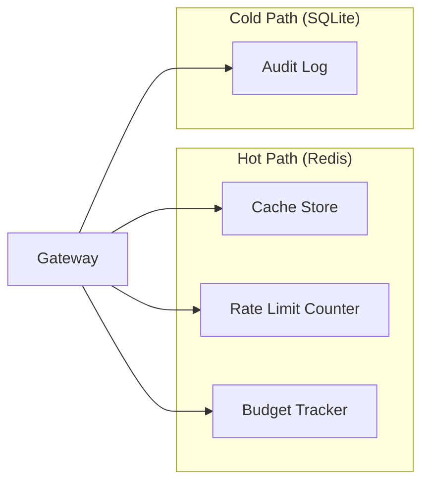

# Architecture

## Request Flow

## Provider Adapter Pattern

## Storage Layer

- **Redis**: Used for data that requires sub-millisecond access — cached responses, rate limit counters, and budget balances. All keys are namespaced by API key and configurable TTLs.
- **SQLite**: Used for append-heavy audit logs. Queried occasionally through the admin API. No operational overhead — it's just a file.
