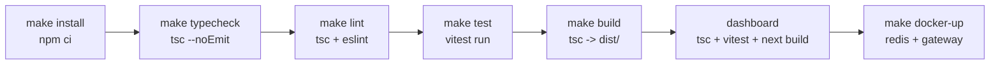
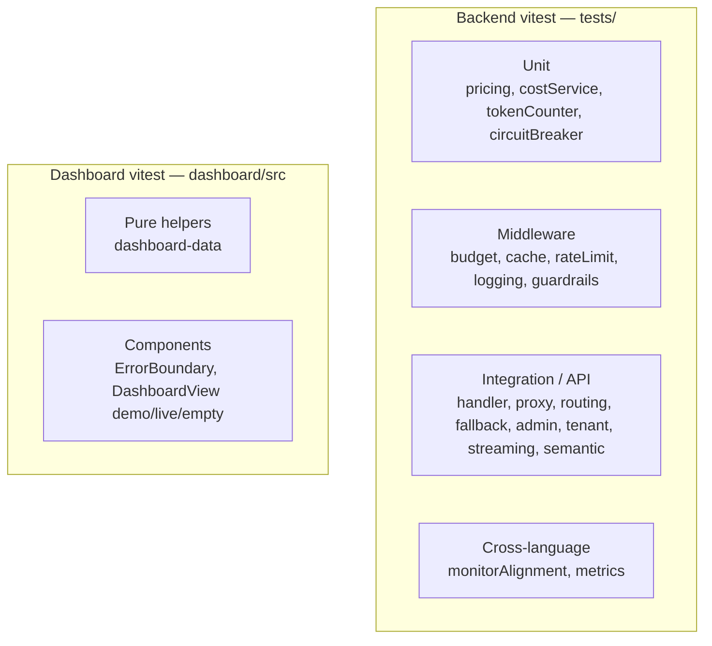

# Execution Plan

How the llm-gateway is built, verified, and brought to (and kept at) the comprehensive bar.
This is the operational companion to [roadmap.md](./roadmap.md) (what) and
[design-decisions.md](./design-decisions.md) (why).

## Pipeline



## Verification gate (must stay green)

| Stage | Command | Expected |
|---|---|---|
| Typecheck (backend) | `npx tsc --noEmit` | clean |
| Lint | `npx eslint .` | clean (0 errors) |
| Backend tests | `npx vitest run` | **150 passing**, 19 files |
| Dashboard typecheck | `cd dashboard && npx tsc --noEmit` | clean |
| Dashboard tests | `cd dashboard && npx vitest run` | **27 passing**, 3 files |
| Dashboard build | `cd dashboard && npx next build` | success |
| (optional) E2E smoke | `cd dashboard && npx playwright test` | demo-mode smoke green |

## Test taxonomy



- **Golden-output gating:** any change touching pricing, cost, or metric values must keep every
  existing numeric output identical. `tests/pricing.test.ts` and `tests/handler.test.ts` pin
  those values; a change that cannot preserve them is deferred to the roadmap, not made.

## Convergence (Priority 2) — status

| Item | Status | Notes |
|---|---|---|
| Pricing module mirroring `shared_core.pricing` | ✅ adopted | `MODEL_PRICING_PER_1M`, sync documented, parity test |
| Audit-log + Prometheus key alignment | ✅ documented + tested | superset of monitor `LLMCall`; `tests/monitorAlignment.test.ts` |
| `claude-3-5-haiku` rate reconciliation | ⏭️ deferred | would change existing cost output; golden-gated, pinned, tracked in roadmap |
| Adopt `shared_core` code | ❌ N/A | Python lib; TS peer stays standalone by design |

## Local run

```bash
make install        # npm ci
make dev            # tsx watch src/index.ts
make test           # vitest run
make demo           # build + print a sample OpenAI-compatible request
cd dashboard && NEXT_PUBLIC_DEMO_MODE=true npm run build && npm start   # dashboard in demo mode
```
