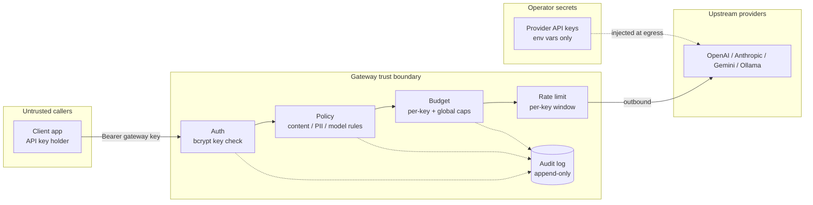

# Security

This document covers the gateway's trust boundaries, the defense-in-depth controls in the
request path, secret handling, and the operator checklist. For the broader domain security
notes see [SECURITY.md](./SECURITY.md).

## Trust boundaries



The gateway is the single point where untrusted client keys are exchanged for trusted upstream
provider credentials. Clients never see provider keys; the gateway never returns them.

## Defense in depth (request path)

| Layer | Control | Failure response |
|---|---|---|
| Auth | API keys validated against **bcrypt** hashes (`apiKeyStore`) | `401` |
| Policy | Regex content filter, PII detection, per-key model restriction | `403` / `policy_denied` |
| Budget | Per-key and global USD caps, pre-flight cost estimate | `402` / `budget_exceeded` |
| Rate limit | Per-key sliding window | `429` / `rate_limited` |
| Audit | Append-only log of every decision (incl. blocks) | n/a (observability) |

## Secrets management

### Gateway API keys
Keys are stored as **bcrypt hashes**, never plaintext:

```yaml
# config.yaml
api_keys:
  - name: production-app
    key_hash: $2b$12$...   # bcrypt hash
    rate_limit_rpm: 60
    budget_usd: 100.0
```

### Provider API keys
Provider credentials live **only** in environment variables and are injected at egress:

```bash
export OPENAI_API_KEY=sk-...
export ANTHROPIC_API_KEY=sk-ant-...
```

Never commit these to git. They are never logged — request logging redacts the caller key to a
short prefix (`sk-secre...`) and never emits upstream keys.

## Audit & redaction
- Every request, policy decision, and budget/rate rejection is recorded in the append-only
  audit log (`status` distinguishes `success` / `error` / `cached` / `policy_denied` /
  `budget_exceeded` / `rate_limited`).
- The logging middleware redacts the API key to an 8-char prefix before emitting structured
  logs (see `tests/logging.test.ts`).

## Threat model (selected)

| Threat | Mitigation |
|---|---|
| Stolen client key | bcrypt-hashed keys, per-key budget/rate caps bound blast radius; revoke via admin API |
| Provider key leakage | keys env-only, never logged, never returned to clients |
| Prompt-injection of disallowed content | policy content/PII filters reject pre-provider |
| Cost-exhaustion / abuse | per-key + global budget caps and rate limits |
| Replay / log tampering | append-only audit log |

## Security checklist

- [ ] API keys use bcrypt (not plaintext)
- [ ] Provider keys in env vars only, never committed
- [ ] Content / PII policies configured
- [ ] Per-key and global budgets enabled
- [ ] Rate limits enabled
- [ ] Audit logging enabled and persisted (SQLite available, not in-memory fallback)
- [ ] Gateway deployed behind TLS termination
