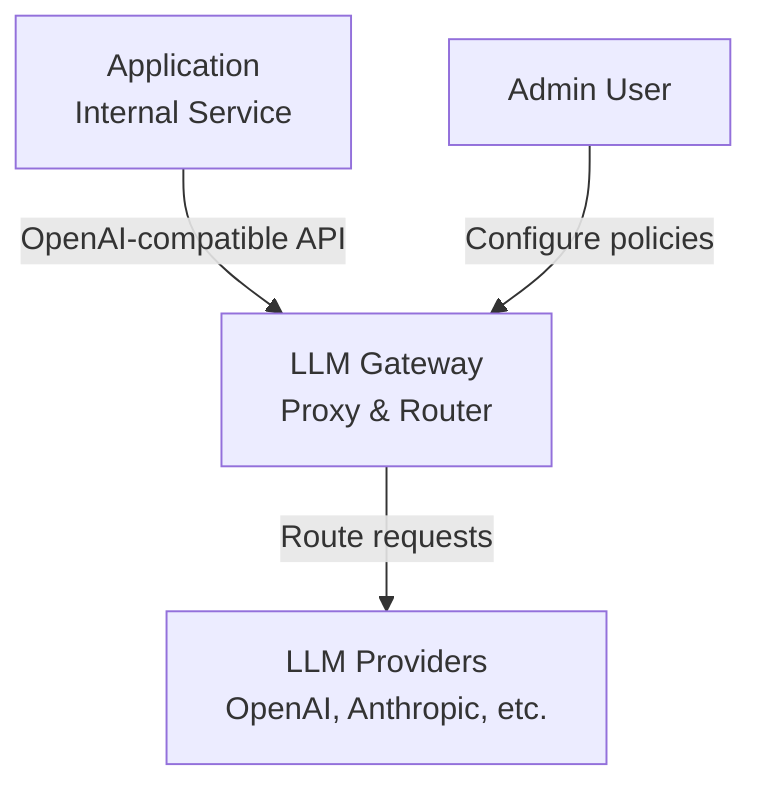
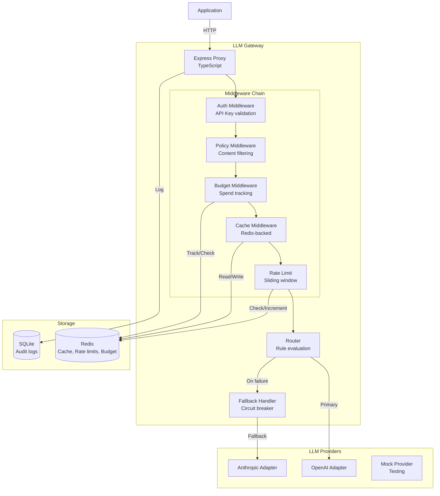
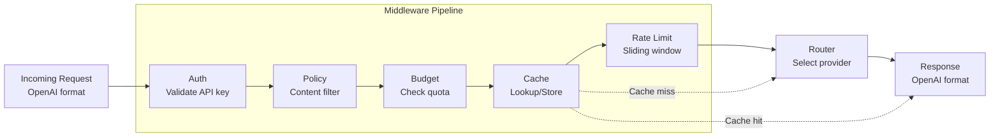
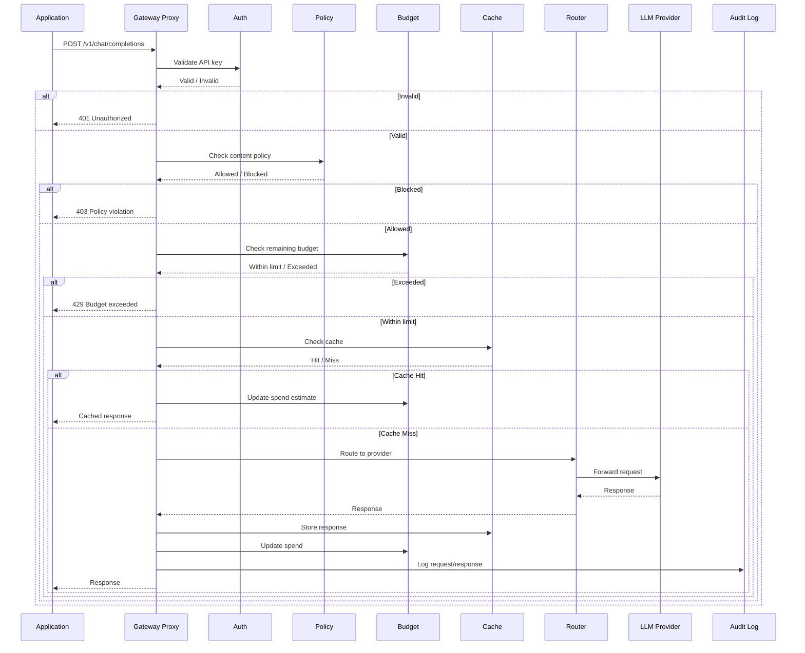

# LLM Gateway Architecture (C4 Model)

## Context Diagram (C4 Level 1)

## Container Diagram (C4 Level 2)

## Component Diagram (C4 Level 3) - Middleware Chain

## Data Flow - Request Processing

## Key Architectural Decisions

| Decision | Rationale |
|----------|-----------|
| **Middleware Chain** | Each concern isolated, testable, composable; order matters |
| **OpenAI-compatible API** | Zero migration cost; existing SDKs work by changing base URL |
| **Redis for Hot Data** | Sub-millisecond latency for caching and rate limiting |
| **SQLite for Audit** | Append-heavy, query-light; zero operational overhead |
| **Circuit Breaker** | Fail fast when provider is unhealthy; improves reliability |
| **Provider Adapters** | Abstract provider differences; easy to add new providers |

## Technology Stack

| Layer | Technology |
|-------|------------|
| Runtime | Node.js 20+, TypeScript 5+ |
| Framework | Express.js 4 |
| Caching | Redis 7 |
| Storage | SQLite 3 |
| Testing | Vitest |
| Deployment | Docker Compose |

## Performance Characteristics

| Metric | Target |
|--------|--------|
| p99 latency overhead | <10ms (cached) |
| p99 latency overhead | <50ms (uncached) |
| Cache hit rate | >60% for repeated queries |
| Rate limit precision | Sliding window, 1-second granularity |
| Provider failover | <100ms detection |
| Concurrent requests | 1000+ per instance |

## Security Model

| Layer | Protection |
|-------|------------|
| Auth | API key validation with bcrypt hashes |
| Policy | Regex + keyword content filtering |
| Rate Limit | Per-key sliding windows |
| Budget | Per-key spend tracking |
| Audit | Full request/response logging |
