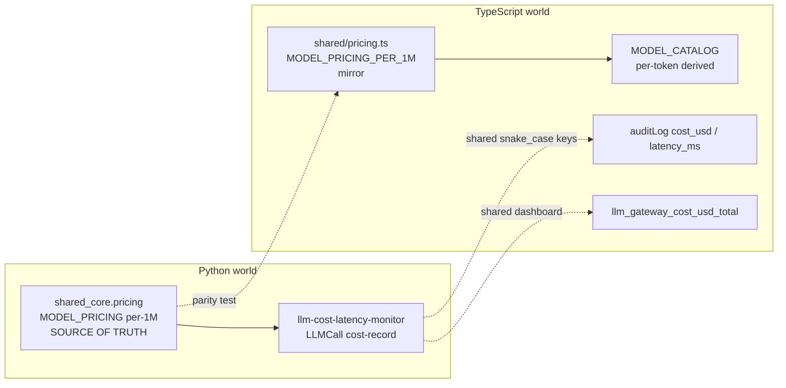

# Design Decisions

Records the decisions made when llm-gateway was migrated into the showcase workspace and the
subsequent comprehensive-bar hardening. Domain docs: [../ARCHITECTURE.md](../ARCHITECTURE.md).

## Decision: stay pure TypeScript (meta-conformance only)

- **Context:** the workspace's `shared_core` is a Python library; this gateway is
  TypeScript/Express.
- **Choice:** do **not** introduce `shared_core` here (it cannot be consumed from Node).
  Conform only the meta-structure — Makefile target vocabulary, docs, AGENTS, workspace
  registration, and `<prefix>_redis` container naming — mirroring `game-systems-sandbox`,
  the existing TypeScript peer. Application code is unchanged.

## Decision: graceful storage fallback kept

- The API-key and audit stores use `better-sqlite3` (a native module) but fall back to an
  in-memory implementation when the binding is unavailable. This is preserved: it lets the
  full test suite run on machines without C++ build tools (and keeps a single-process dev
  mode working with no database).

## Decision: cross-language alignment is data-parity, not code-sharing

- The gateway overlaps conceptually with the Python `llm-cost-latency-monitor`. Rather than
  share code across languages, the design keeps the **pricing data**, **audit schema**, and
  **Prometheus label keys** aligned so a single dashboard can read both.

- **Pricing:** `shared_core.pricing.MODEL_PRICING` (USD per 1,000,000 tokens) is the single
  source of truth. `src/shared/pricing.ts` mirrors it as `MODEL_PRICING_PER_1M`; the running
  gateway's per-token `MODEL_CATALOG` is *derived* from that table, so there is exactly one
  place to edit. `tests/pricing.test.ts` pins the shared values and fails on drift.
- **Sync procedure:** when the Python registry changes, update `MODEL_PRICING_PER_1M` and the
  pinned golden snapshot in the test, then re-run `npx vitest run tests/pricing.test.ts`.
- **Known intentional divergence:** `claude-3-5-haiku` is 0.80 / 4.00 in `shared_core` but the
  gateway's dated id `claude-3-5-haiku-20241022` historically uses 1.00 / 5.00. Changing it
  would alter existing cost/budget outputs, so it is left as-is, documented, and excluded from
  the strict parity assertion (tracked in roadmap.md). `gemini-*` models are gateway-only.

## Decision: golden-output gating for any numeric change

- Pricing, cost, and metric values are treated as golden outputs. Refactors (e.g. deriving the
  per-token catalog from the per-1M table) are required to keep every existing value
  byte-identical, verified by `tests/pricing.test.ts` and `tests/handler.test.ts`. A change
  that cannot preserve a value is not made — it is recorded as a follow-up instead.

## Decision: audit-log + metrics schema aligned with the Python monitor

- The audit row uses snake_case columns (`model`, `provider`, `input_tokens`, `output_tokens`,
  `cost_usd`, `latency_ms`, `status`, `error_message`, ...) that are a **superset** of the
  Python monitor's `LLMCall` cost-record fields. The Prometheus cost series is
  `llm_gateway_cost_usd_total{provider,model}`. `tests/monitorAlignment.test.ts` pins these
  key names so a rename is caught, enabling one Grafana dashboard to query either store.

## Decision: dashboard demo-mode + resilience

- The optional Next.js dashboard ships a **demo mode**: when the gateway backend is
  unreachable (or `NEXT_PUBLIC_DEMO_MODE=true`), it renders deterministic sample data with a
  visible banner instead of only an error screen, so the UI is presentable with no backend.
- Render-time errors are contained by an `ErrorBoundary` so a malformed payload cannot blank
  the whole console. Pure data-shaping logic is extracted to `lib/dashboard-data.ts` so it is
  unit-testable without rendering React.
