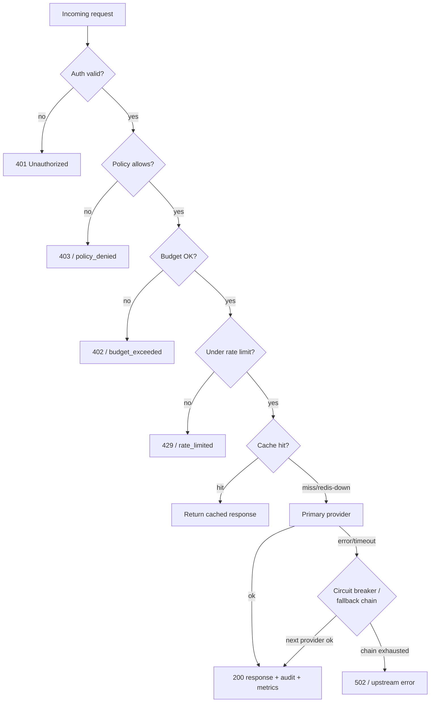

# Failure Modes

This document enumerates how the gateway degrades under failure, how each failure is
detected, and what the client observes. The guiding principle is **graceful degradation**:
a failure in an optional subsystem (cache, audit DB, one provider) must never take down the
request path.

## Degradation map

## Upstream provider failure
- **Cause:** a provider (OpenAI / Anthropic / Gemini / Ollama) errors or times out.
- **Detection:** the provider adapter raises a typed `ProviderError`; the router records the
  failure against a per-provider circuit breaker.
- **Mitigation:** configurable **fallback chains** route to the next provider; the
  circuit breaker fails fast once a provider crosses its failure threshold and resets after a
  cool-down. The OpenAI-compatible response contract is preserved for the client.
- **Client sees:** a successful response from the fallback provider, or `502` only if the
  whole chain is exhausted. The `fallback_used` label/column records that a fallback fired.

## Budget exceeded
- **Cause:** an API key passes its configured spend limit (per-key or global).
- **Detection:** `budgetTracker` accumulates per-key cost; the budget middleware estimates the
  request cost up front via `shared/pricing` and compares against the remaining allowance.
- **Mitigation:** the request is rejected **before** reaching a provider with HTTP `402` and
  `code: budget_exceeded`. Budgets are configured as code in `config/budgets.example.yaml`.
- **Client sees:** `402` with the remaining and estimated amounts in the message.

## Rate limit exceeded
- **Cause:** a key exceeds its request window (default 60 rpm).
- **Detection:** a sliding-window counter (Redis sorted-set, in-memory fallback) in
  `middleware/rateLimit.ts`.
- **Mitigation:** returns `429` with `code: rate_limit_exceeded`. Per-key overrides are
  supported via `setKeyRateLimit`.

## Redis unavailable
- **Cause:** the cache / budget / rate-limit Redis is down or unreachable.
- **Detection:** `ioredis` connection errors are suppressed and the client handle is dropped
  to `null`.
- **Mitigation:**
  - **Cache:** best-effort — a lookup miss falls through to the provider; a store failure is
    ignored. No request fails because of a cache outage.
  - **Rate limit:** falls back to an **in-process** sliding window (per-instance, not
    cluster-wide).
  - **Budget:** degrades to the configured in-memory tracker.

## SQLite / native binding unavailable
- **Cause:** `better-sqlite3` cannot load (no C++ build tools / unsupported platform).
- **Detection:** logged once as `SQLite unavailable, using in-memory fallback`.
- **Mitigation:** the API-key and audit stores fall back to in-memory. The gateway and its
  full test suite still run.
- **Caveat:** audit history is **not persisted across restarts** in this mode.

## Policy / guardrail violation
- **Cause:** a request hits a content-filter, PII, or model-restriction policy.
- **Detection:** the policy middleware evaluates rules in `config/policy.example.yaml`.
- **Mitigation:** the request is rejected before reaching a provider; the decision is recorded
  in the append-only audit log with `status: policy_denied`.

## Failure-mode summary

| Failure | Detection | Client impact | Degraded behaviour |
|---|---|---|---|
| Provider error/timeout | typed `ProviderError` + breaker | none (fallback) or `502` | next provider in chain |
| Budget exceeded | pre-flight cost estimate | `402` | request rejected early |
| Rate limit | sliding-window counter | `429` | in-memory window if Redis down |
| Redis down | ioredis error | none | best-effort cache, local rate/budget |
| SQLite/native missing | import failure | none | in-memory stores (no persistence) |
| Policy violation | policy rule match | `403` | logged + rejected pre-provider |
