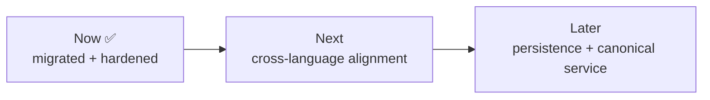

# Roadmap

Product roadmap: [../ROADMAP.md](../ROADMAP.md). This file tracks the follow-ups from joining
the showcase workspace and the comprehensive-bar hardening.

## Now (done)
- ✅ Meta-structure conformed (Makefile vocabulary, docs, AGENTS, registration).
- ✅ `<prefix>_redis` / `<prefix>` container naming (`llm_gateway`, `llm_gateway_redis`).
- ✅ `tsc --noEmit` clean; backend **vitest suite expanded 106 → 150** (pricing parity,
  CostService, rate-limit/logging middleware, metrics + monitor-alignment).
- ✅ **Pricing parity module:** `shared/pricing.ts` mirrors `shared_core.pricing` per-1M rates
  as `MODEL_PRICING_PER_1M` (single source of truth, sync documented); `tests/pricing.test.ts`
  pins the shared values and fails on drift.
- ✅ **Schema alignment documented + tested:** audit-log snake_case columns are a superset of
  the Python monitor's `LLMCall` cost-record; `llm_gateway_cost_usd_total{provider,model}`
  pinned by `tests/monitorAlignment.test.ts`.
- ✅ **Dashboard polished:** demo-mode fallback + banner, `ErrorBoundary`, extracted testable
  data helpers, 27 vitest component tests, an optional Playwright smoke spec, green `next build`.

## Next — cross-language alignment with llm-cost-latency-monitor (ticket-only)
- Reconcile the **`claude-3-5-haiku` divergence**: the gateway's dated id uses 1.00 / 5.00 per
  1M while `shared_core` lists 0.80 / 4.00. This is golden-output-gated (changing it moves
  existing cost/budget numbers), so it is deferred and pinned by a test rather than silently
  changed. Reconcile by either updating shared_core, re-mapping the gateway id, or accepting
  the divergence formally.
- Add the gateway's gemini rates to `shared_core` (or document them as gateway-only) so the two
  registries fully overlap.
- Stand up a single Grafana dashboard that reads both the gateway's `llm_gateway_*` metrics and
  the monitor's metrics, proving the key-name alignment end-to-end.
- Decide whether this standalone gateway or `knowledgeops/services/llm-gateway` is canonical
  (and retire/redirect the other).

## Later
- Provide a `better-sqlite3` build path or a prebuilt binary so audit persistence works
  out-of-the-box on Windows without C++ build tools.
- Wire the optional Playwright smoke spec into CI behind a browser-install cache.

## Intentionally not building (now)
- Introducing `shared_core` (Python) into this TypeScript project — it stays a standalone TS
  peer, like `game-systems-sandbox`. Cross-language alignment is data-parity, not code-sharing.
