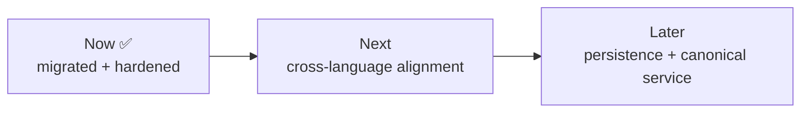

# Roadmap

Product roadmap: [../ROADMAP.md](../ROADMAP.md). This file tracks the follow-ups from joining
the showcase workspace and the comprehensive-bar hardening.

```mermaid
flowchart LR
    Now[Now ✅<br/>migrated + hardened] --> Next[Next<br/>cross-language alignment]
    Next --> Later[Later<br/>persistence + canonical service]
```

## Now (done)
- ✅ Meta-structure conformed (Makefile vocabulary, docs, AGENTS, registration).
- ✅ `<prefix>_redis` / `<prefix>` container naming (`llm_gateway`, `llm_gateway_redis`).
- ✅ `tsc --noEmit` clean; backend **vitest suite expanded 106 → 150** (pricing parity,
  CostService, rate-limit/logging middleware, metrics + monitor-alignment).
- ✅ **Pricing parity module:** `shared/pricing.ts` mirrored `shared_core.pricing` per-1M
  rates as `MODEL_PRICING_PER_1M`; with upstream archived (2026-08-13) the table is now
  **self-owned, frozen at v1.3.0 parity** — `tests/pricing.test.ts` pins the frozen
  snapshot.
- ✅ **Schema alignment documented + tested:** audit-log snake_case columns are a superset of
  the Python monitor's `LLMCall` cost-record; `llm_gateway_cost_usd_total{provider,model}`
  pinned by `tests/monitorAlignment.test.ts`.
- ✅ **Dashboard polished:** demo-mode fallback + banner, `ErrorBoundary`, extracted testable
  data helpers, 27 vitest component tests, an optional Playwright smoke spec, green `next build`.

## Next — cross-language alignment (ticket-only)

Upstream `operator-shared-core` was archived 2026-08-13 and `llm-cost-latency-monitor` was
consolidated into agenttrace, so these are now **self-owned decisions**, not sync work:

- Reconcile the **`claude-3-5-haiku` divergence**: the gateway's dated id uses 1.00 / 5.00 per
  1M while the frozen shared-core v1.3.0 snapshot lists 0.80 / 4.00. This is
  golden-output-gated (changing it moves existing cost/budget numbers), so it is deferred
  and pinned by a test rather than silently changed. Reconcile by either re-mapping the
  gateway id or accepting the divergence formally.
- The gateway's gemini rates are gateway-only by default now — document them as such, or
  adopt them into the frozen snapshot if a second consumer ever appears.
- Stand up a single Grafana dashboard that reads both the gateway's `llm_gateway_*` metrics
  and the monitor's metrics, proving the key-name alignment end-to-end.

Settled, no longer open: the canonical-gateway question was resolved 2026-08-12 —
`knowledgeops` (incl. `services/llm-gateway`) was consolidated into groundtruth and
archived; this standalone gateway is the canonical one.

## Later
- Provide a `better-sqlite3` build path or a prebuilt binary so audit persistence works
  out-of-the-box on Windows without C++ build tools.
- Wire the optional Playwright smoke spec into CI behind a browser-install cache.

## Intentionally not building (now)
- Introducing `shared_core` (Python) into this TypeScript project — it stays a standalone TS
  peer, like `game-systems-sandbox`. Cross-language alignment is data-parity, not code-sharing.
